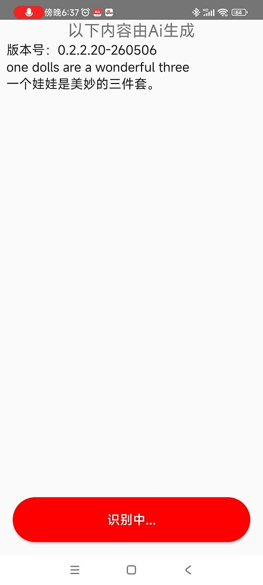

# En2Cn
英语到中文 Android 语音识别 + 翻译应用。
 一个小翻译，可以发出声音，翻译出来的内容他会读出来，避免发生回馈请使用耳机或将手机音量关闭。 个人在玩游戏和读英文网站的时候使用。它对原生英语的识别相对更好一些。

 
 
 欢迎使用。
 
原生发布地址：https://www.unicoder.cn/forum.php?mod=viewthread&tid=595&page=1&extra=#pid2472
